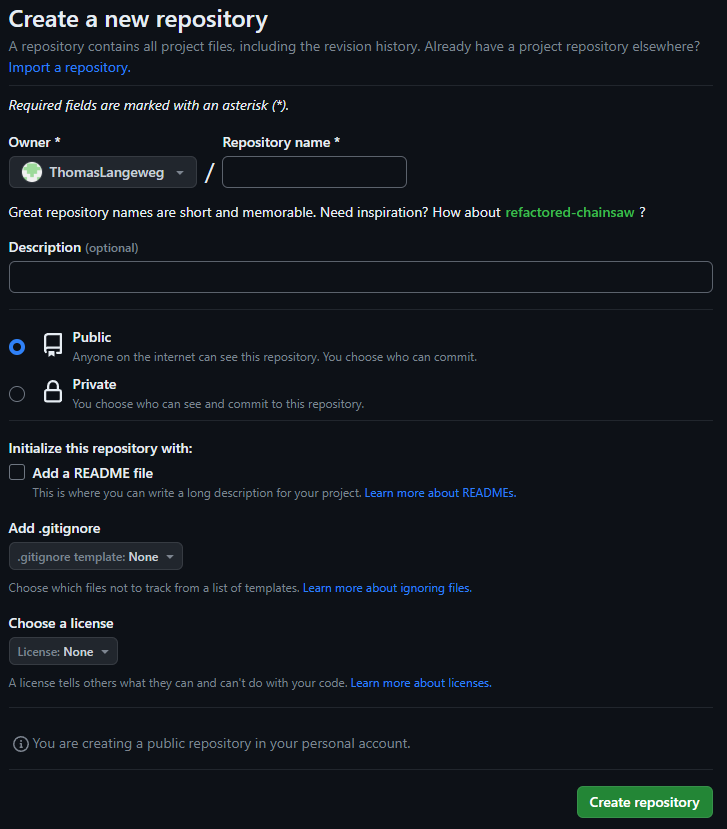
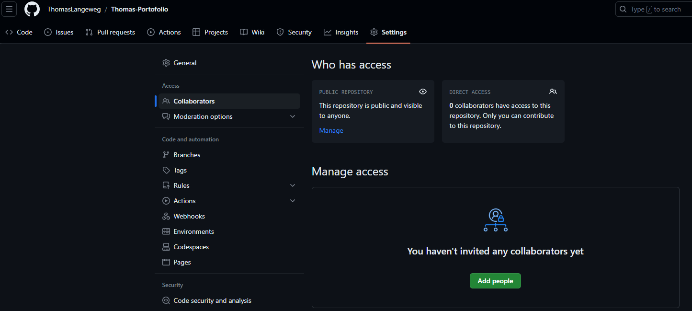

# Git & Github
Leren hoe je moet omgaan met Git en Github, hoe je moet omgaan met **Source code Management** en **version control**

## Key-terms
1. Gedistribueerde en gecentraliseerde versiebeheer [x]
2. Repository [x]
3. Main/Master [x]
4. Branch [x]
5. Commit [x]
6. Push/Pull [x]
7. Merge [x]
8. Fork [x]

## Opdracht
### Gebruikte bronnen
Voor algemene kennis van versiebeheer https://git-scm.com/book/nl/v2/Aan-de-slag-Over-versiebeheer

Vedere bronnen github fundamentals https://github.com/techgrounds/git-github-fundamentals-ThomasLangeweg

### Ervaren problemen
[Geef een korte beschrijving van de problemen waar je tegenaan bent gelopen met je gevonden oplossing.]

### Resultaat
1. Opdracht 1: 
   * Het aanmaken van een repository

   * Via Settings -> Collaborators -> Add people heb ik mijn mede peers uitgenodigd

   * Met Github Desktop wat aanpassingen en code opgestuurd naar de repository op Github.
   *  