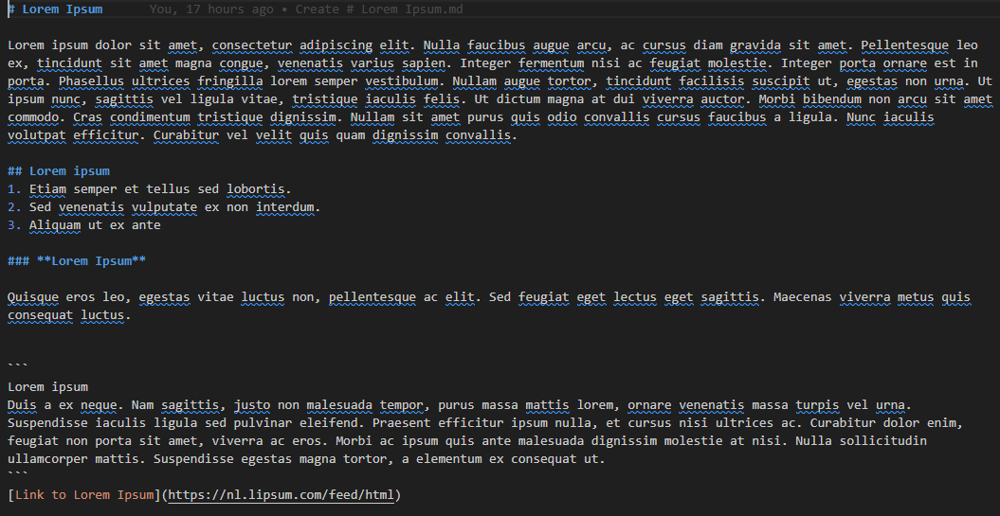
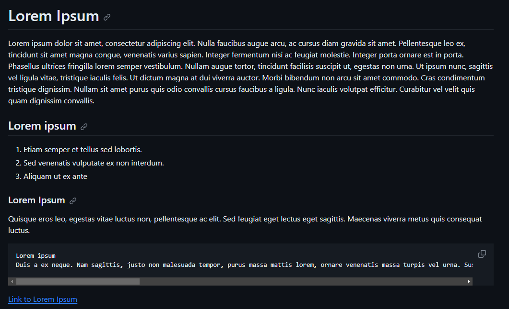

# Markdown
[Geef een korte beschrijving van het onderwerp]

## Key-terms
1. Markdown [x]
2. WYSIWYG [x]
3. WYSIWYM [x]

## Opdracht
### Gebruikte bronnen

Gebruik van de volgende cheatsheet: https://devhints.io/markdown 

Voor Markdown: https://www.youtube.com/watch?v=34_dRW42kYI&ab_channel=NeuralNine

Markdown te gebruiken in VS code: https://www.youtube.com/watch?v=DLLrcr9u_XI&ab_channel=DeAndreQueary 

### Ervaren problemen
Het lukte mij niet om Markdown te gebruiken voor VS code, na het vinden van een Youtube filmpje over hoe het op te zetten, verder geen problemen in het maken van de opdracht. 

### Resultaat
Aan de hand van de cheatsheet en wat voorbeelden online heb ik het onderstaande gemaakt:

Wat zich vertaalde in het onderste:

