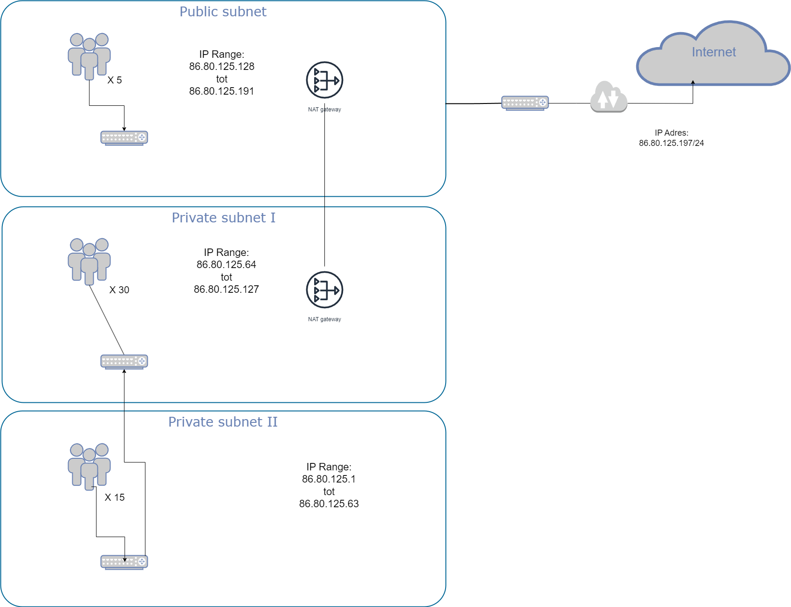

# Subnetting
Het begrijpen en het maken van een voorbeeld met Subnet. 

## Key-terms
1. Subnet [x]
2. Subnet Mask [x]
3. CIDR [x]
4. Private [x]
5. Public [x]
6. Class A,B,C [x]
7. NAT [x]

## Opdracht
### Gebruikte bronnen
Voor Subnet: https://www.calculator.net/ip-subnet-calculator.html

https://www.youtube.com/watch?v=s_Ntt6eTn94&ab_channel=PowerCertAnimatedVideos

https://www.youtube.com/watch?v=ujXr0i5EoHE&ab_channel=CloudAcademy

### Ervaren problemen

### Resultaat
Hieronder mijn subnet met de onderstaande parameters:
*  Subnet dat alleen van binnen het LAN bereikbaar is. Dit subnet moet minimaal 15 hosts kunnen plaatsen.
*  Subnet dat internet toegang heeft via een router met NAT-functionaliteit. Dit subnet moet minimaal 30 hosts kunnen plaatsen (de 30 hosts is exclusief de router).
*  Subnet met een network gateway naar het internet. Dit subnet moet minimaal 5 hosts kunnen plaatsen (de 5 hosts is exclusief de internet gateway).

