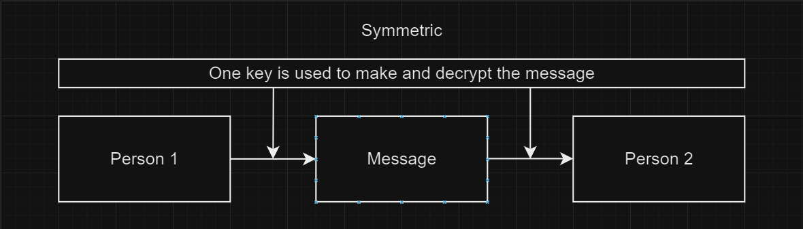
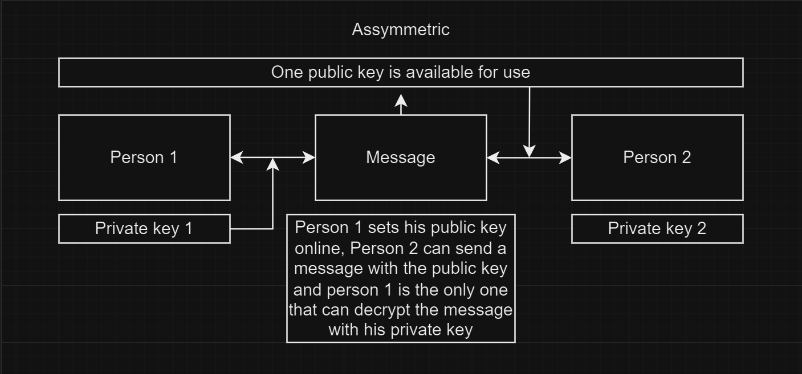

# Asymmetric Decryption
In de vorige opdracht gewerkt met symmetric decryption, hier achter gekomen dat het niet heel handig is om iets goed te beveiligen. Daar is asymmetric wel een stuk beter voor. 

## Key-terms
1. Asymmetric Decryption [x]
2. RSA [x]
3. Padding [x]

## Opdracht
### Gebruikte bronnen
Voor de decryption zelf https://www.devglan.com/online-tools/rsa-encryption-decryption


### Ervaren problemen
Het was voor mij lastig te begrijpen wat je deelt en wat je juist bewaard voor iedereen. Na wat "uren" zoeken heb ik gevonden wat ik moet doen en delen.  

### Resultaat
Hieronder heb ik voor deze opdracht mijn Public key en mijn Private key gemaakt:
```
Public:
MIGfMA0GCSqGSIb3DQEBAQUAA4GNADCBiQKBgQDLaiXEcOrT9letlxHe3EgdW3+4wv++VdOhCsxehsZskb6RGooXUayVkCpwTVeynSUyPtyZJ7VOjRzfrGoJq6Ky56sPrMq5oxL4I/n7JGSL0I3qDXX+ztSzTeH4gXV5rkDPjZy+4wZ47IxdAxGvP/CT/kYhfNzj2Ys+keFx1xfgbQIDAQAB
```

```
Private: 
MIICdwIBADANBgkqhkiG9w0BAQEFAASCAmEwggJdAgEAAoGBAMtqJcRw6tP2V62XEd7cSB1bf7jC/75V06EKzF6GxmyRvpEaihdRrJWQKnBNV7KdJTI+3JkntU6NHN+sagmrorLnqw+syrmjEvgj+fskZIvQjeoNdf7O1LNN4fiBdXmuQM+NnL7jBnjsjF0DEa8/8JP+RiF83OPZiz6R4XHXF+BtAgMBAAECgYEAuImIz8jc0QSYEEyQEs1mwvNiUHzfRI5aWqwQMeU1GAO0jbE0++jFmD3cslsIJ2s29nle6bbDXgrY2fZxkGpcQzAsNVCVYC9LjR3EBL3ybP6zvyNSuTL2Am4QwkID7OPWVaEfv0yhhSiTO9gJ4maebnQJ+FUuXI0D+7BITRDDYsECQQD4bb1oxN69/1fAPhGjAL54iX2dJRxn8kR89V2717m1QkyyGmXjwDRbwTbN7tDuL03DDvhbWV4KGO8wiCJGnrqxAkEA0Z00YVVo25RKPPxawZIwQohWCRTLhbi5teIVjD/iZN/dbFdK16qaGpBW0ZD3HB94tdD8vfPckNnkIX1r/sA4fQJAN/Q3qiZVaQPfFtykCku7mtiU41UdfcgSZva44vsmx82kCqVpd4+t+1CccGuuwUcEQ7/WbnTFeo69KPgwiCluMQJAQSrluQkLs5CT0AgI0zt244htbx9W8vjuS7zBRDwsT35F4cP10b0Jcg7D3x15pfWm2qfhm9CwFxyWz06l/6qVJQJBAM9ySPs+XO8hz91k4qJWyV7P9cK3QJ1qcw3lLxyzK5oxMHQczcjvw0xE/QJ9S71/Bc9y7JHGsZzMJ6tZNr1Uw88=
```

Hiermee heb ik met een cohortgenoot een bericht gedeeld en verschillende berichten gestuurd. 

Voor mezelf nog even twee diagrammen gemaakt:




