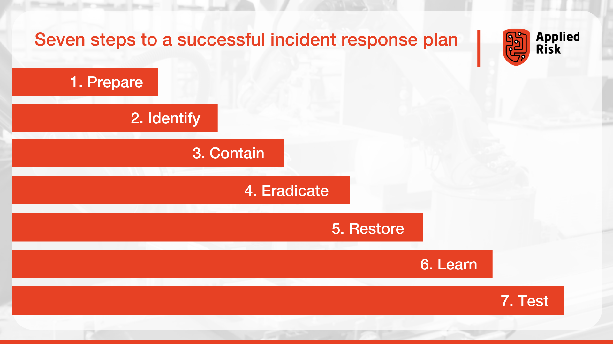

# Detection, response en Analysis
Wat moet je doen bij een aanval in je network. Hoe wordt het gezien en hoe wordt het tegengehouden? En natuurlijk wat leer je hiervan?

## Key-terms
1. **Intrusion Detection System (IDS)**: Is een systeem wat een indringing detecteerd, het geeft dan een alert richting de juiste personen. Om te laten weten dat er een breach is van hun systeem. De IDS past in hun firewall of ergens intern in het systeem. Van te voren wordt er bepaald waar het detecteren plaats moiet vinden.  
   
2. **Intrusion Prevention System (IPS)**: Heeft bijna dezelfde taak als een IDS, het kan detecteren wanneer er een indringing plaats vindt. Een extra stap van een IPS is dan dat het ook de bedreiging tegen kan houden. Ook hier wordt er van te voren bepaald waar dit plaats vind. Dit kan aan de voorkant of ergens in een netwerk achterin.
     
3. **Hack response strategies**: Van wat ik overal kan vinden zijn er verschillende manieren om cyberaanvallen tegen te gaan. De meest voorkomende bestaat uit 7 stappen:

1. **Systems hardening**: Systems hardening is a collection of tools, techniques, and best practices to reduce vulnerability in technology applications, systems, infrastructure, firmware, and other areas. The goal of systems hardening is to reduce security risk by eliminating potential attack vectors and condensing the system’s attack surface. By removing superfluous programs, accounts functions, applications, ports, permissions, access, etc. attackers and malware have fewer opportunities to gain a foothold within your IT ecosystem. There are multiple types of hardening and i will explain some below. Although the principles of system hardening are universal, specific tools and techniques do vary depending on the type of hardening you are carrying out.
   
2. **Disaster recovery options** Heb ik voorbeeld DRAAS gevonden, while Disaster Recovery as a Service (DRaaS) is often based in the cloud, it is not strictly cloud-based. Some DRaaS providers offer their solutions as a site-to-site service, in which they host and run a secondary hot site. Additionally, providers can rebuild and ship servers to an organization’s site as a server replacement service. On the other hand, cloud-based DRaaS enables users to failover applications immediately, orchestrate failback to rebuilt servers, and reconnect users through VPN or Remote Desktop Protocol.

## Opdracht
### Gebruikte bronnen
Voor een korte uitleg over IDS en IPS: https://www.youtube.com/watch?v=wQSd_piqxQo&ab_channel=CBTNuggets

https://applied-risk.com/resources/seven-steps-to-implementing-a-successful-incident-response-plan#:~:text=In%20the%20event%20of%20a,incident%3B%20preparation%20is%20everything

https://www.beyondtrust.com/resources/glossary/systems-hardening

### Ervaren problemen
[Geef een korte beschrijving van de problemen waar je tegenaan bent gelopen met je gevonden oplossing.]

### Resultaat

Hieronder staat aangegeven dat er dagelijks een backup gemaakt wordt van hun database, dus elke 24 uur wordt er een backup gemaakt van alle data. Dit vertaald zich dan in een RPO van bijna 24 uur. In dit voorbeeld kan er een backup gemaakt worden om middennacht. Alles van de volgende dag heeft dus "niet bestaan" omdat we opnieuw werken vanuit de voorgaande back up.

In het volgende voorbeeld wordt er gevraagd naar de RTO, hierin zie ik staan dat het 8 minuten duurt voor de laatste versie van github wordt gehaald. De RTO is dan 8 minuten voor er weer een werkende versie van de website is. 

