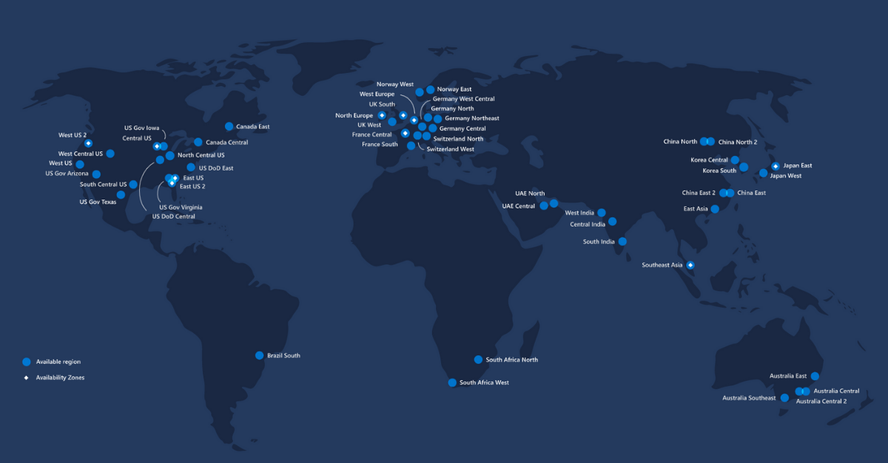
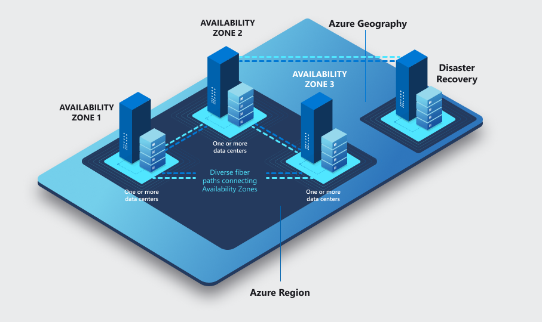

# Azure Global Infrastructure
Hoe de infrastructuur geregeld is in Azure, waar staan de servers en welke keuzes heb je per zone. 

## Key-terms
1. **Azure Region**: Is een set datacenters welke gebruikt worden op basis van latentie standaards en verbonden met een regionaal netwerk. De regio's zijn echter ver genoeg uit elkaar om lokale storingen en bijvoorbeeld rampen/slecht en daardoor de uitval van het hele systeem te reduceren.

2. **Azure Availability Zone**: Elke regio heeft meerdere sites met servers, deze zijn met elkaar verbonden met hoge internet snelheid en hebben hun eigen elektriciteit, koeling en netwerking. 

3. **Azure Region Pair**: Sommige eerder benoemde Azure Region worden gelinkt met elkaar, deze regions zijn vaak ver uit elkaar gelegen. Deze zijn door Azure gelinkt en hier heb je geen keuze in. Elke update op de services worden op hetzelfde moment uitgevoerd. 
   

## Opdracht
### Gebruikte bronnen
Waar staan Azure regions https://www.dataweb.nl/waar-staan-de-microsoft-azure-datacenters/#:~:text=Microsoft%20Azure%20infrastructuur&text=Een%20regio%20is%20een%20set,via%20een%20toegewezen%20regionaal%20netwerk.

### Ervaren problemen

### Resultaat
Je hebt meerdere regio's (servers) waar je gebruik van kan maken, de keuze die je moet maken is op basis van de latency die je wilt hebben en welke services je nodig hebt voor jouw product. Niet alle servers hebben namelijk dezelfde services. Voor alle services:
https://azure.microsoft.com/en-us/explore/global-infrastructure/products-by-region/
