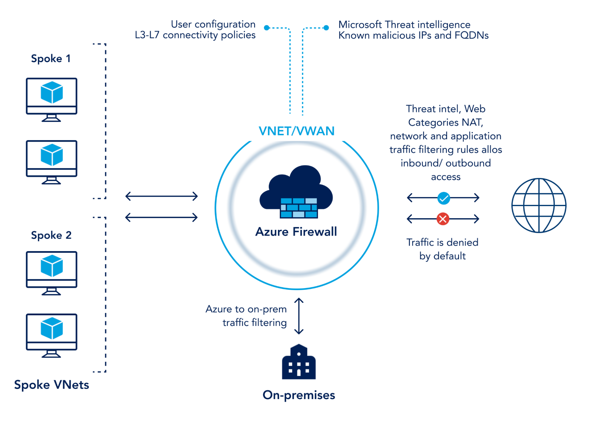
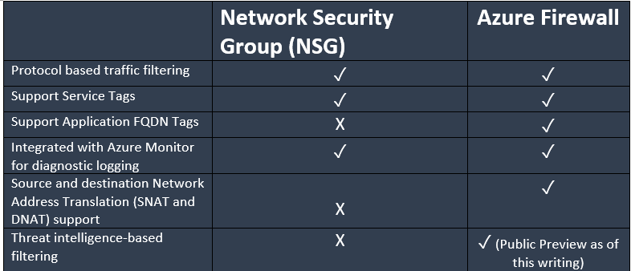

# Firewalls
In deze opdracht wil ik de firewall (NSG) aanzetten voor mijn VM:

## Key-terms
Verschil NSG en Firewall:

## Opdracht
### Gebruikte bronnen
[Plaats hier de bronnen die je hebt gebruikt.]

### Ervaren problemen

### Resultaat

Hieronder heb ik de port naar mijn virtual machine voor SSH (22) niet openstaan maar wel de port naar HTTP (80)

