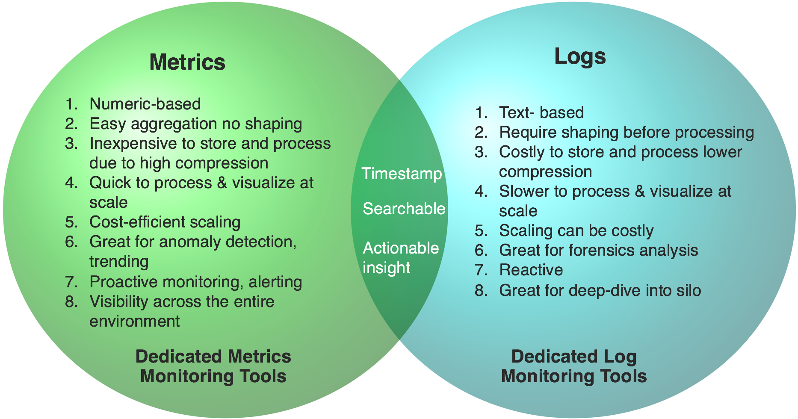
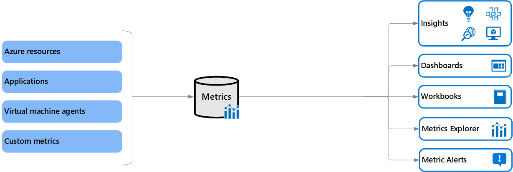
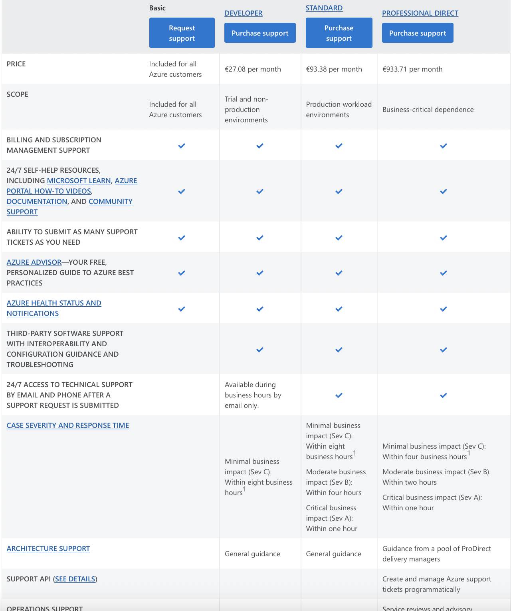

# Azure Monitor & Azure Support Plans
Deze dag staat in de planning om een Azure Monitor te maken en te kijken hoe alles werkt. Ook wil ik de Service Support plans bekijken. 

### Ervaren problemen

### Resultaat

**Azure Monitor**
--
### Key-terms
* **Azure Monitor**: Is een service dat logboekgegevens en metrics van verschillende bronnen, zoals toepassingen, virtuele machines, containers, netwerken en andere services in Azure verzamelt. Hier kan je dan alerts op afstemmen en eventuele problemen opzoeken. 
  

* **Metrics**: In Monitor kan je metrics naar voren halen, dit zijn nummers en getallen in je gekozen resources welke dan opgeslagen kunnen worden over bepaalde periodes. Zo kan je bijvoorbeeld workflow visualiseren over van een VM en een alert instellen dat je hier kennis over krijgt. Je kunt Metrics gebruiken om interactief te bestuderen, waarschuwingen te ontvangen wanneer een waarde een drempel passeert met een melding, of ze bekijken in een spreadsheet of dashboard. 

* **Logs**: Azure Logs een meer uitgebreide benadering door logboekgegevens te verzamelen, op te slaan en te analyseren voor monitoring, probleemoplossing en inzichten in de gezondheid van systemen en toepassingen.

### Gebruikte bronnen
1. https://www.youtube.com/watch?v=v68jL-l9Fww&ab_channel=JohnSavill%27sTechnicalTraining
2. https://learn.microsoft.com/en-us/azure/azure-monitor/essentials/data-platform-metrics
3. https://learn.microsoft.com/en-us/azure/azure-monitor/logs/data-platform-logs
4. 

### Opdracht

* Waar kan ik deze dienst vinden in de console?
  
Door in de zoekbalk boven "Monitor" te zoeken. 

* Hoe zet ik deze dienst aan?
  
Hier heb ik bijvoorbeeld een metric aangemaakt van mijn eerdere opdracht:

* Hoe kan ik deze dienst koppelen aan andere resources?
Je krijgt hier de keuze om een metric of een log aan te maken van een andere resource, je moet hier dus de keuze maken om dit te "koppelen" met een andere resource voor dat het werkt. 

**Azure Support Plans**
--
### Key-terms
1. **Basic**: Deze is beschikbaar voor alle Azure Accounts en is dan ook gratis. Hier hebben de users toegang tot documenten en kunnen ze tickets aanmaken. 
2. **Developer**: Deze zit hem in de naam, dit kan je het beste gebruiken voor testomgevingen en om iets te developen. Dit is dus niet handig als je iets in een productie omgeving moet werken. Dit kan je tijdens werktijden bereiken via mail en dan krijg je in een reatie in 8 werkuur.
3. **Standard**: Dit pakket is duurder tegenover Developer omdat je werkt in een productieomgeving. Hier krijg je dan ook sneller support omdat er anders dingen of services stil blijven liggen. De verwachting is dan ook dat je binnen 1 uur een antwoord krijgt vanuit support Azure. 
4. **Profesional Direct**: Buiten dat dit ook in de productie omgeving zit, gaat het hier om processen en services die echt nodig zijn om iets te laten draaien. Dit is kritiek in de werkzaamheden van een bedrijf. Ook krijg je hier Prodirect hulp en sturing vanuit Azure. Dit is wel de duurste optie per maand. 

